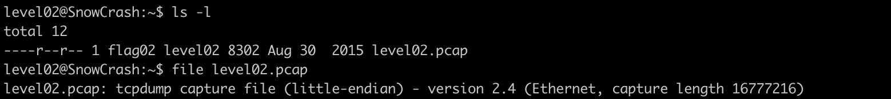
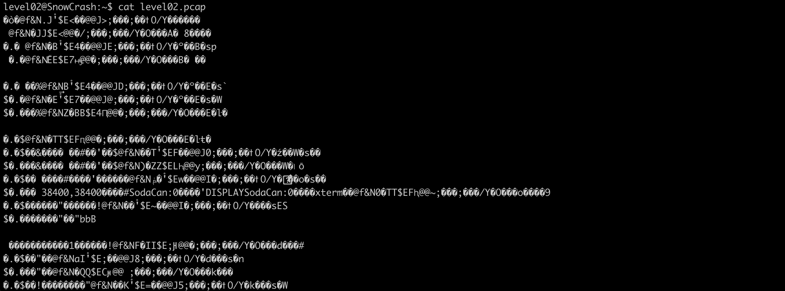
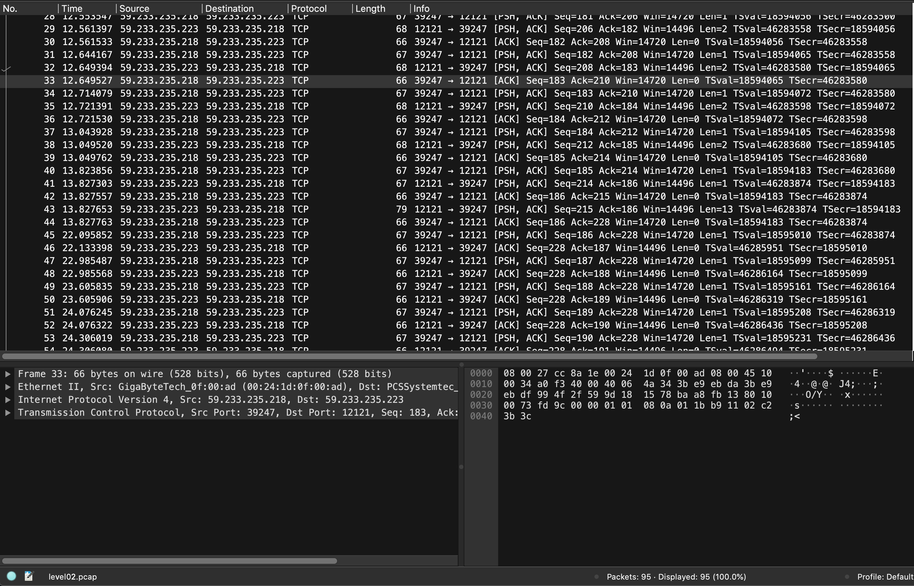
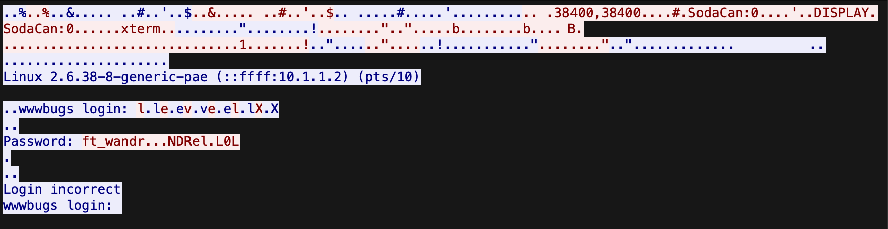
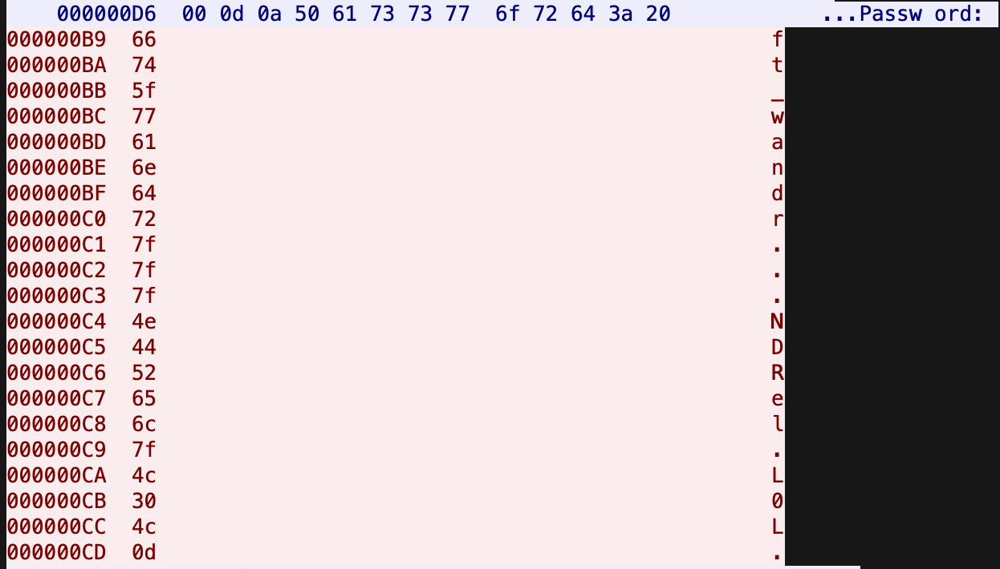
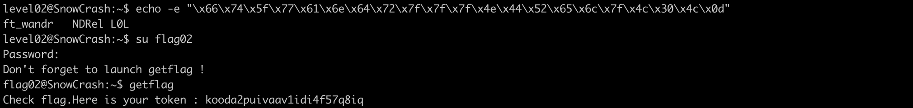

# Level 02

## Level Overview

**Category** : Network Forensics / Traffic Analysis

**Description** : Analyze captured network traffic to extract authentication credentials from unencrypted communications.

## Analysis

This challenge presents us with a tcpdump capture file, commonly known as a pcap file.

>A pcap file, short for Packet CAPture, is a binary file format used to store captured network packet data from a network, such as Ethernet or Wi-Fi traffic.

Printing the content of the file in STDOUT shows gibirish data, which means we need another tool to read this type of files.

For this we are going to use Wireshark.

>Wireshark is a free and opensource system or tool for analyzing network traffic. It can monitor what is sent or received via the internet on your system and monitor saved network traffic like PCAP files.

Once the file is uploaded in Wireshark we see a total of 95 packets transfered between 2 addresses using **TCP Protocol** 

We can use Wireshark to get the exact communication between the client & the server in ASCII mode or hexadecimal mode.

Right click on any traffic ➡️ Follow ➡️ TCP Stream (or HTTP Stream, both end up the same)

The ASCII view shows clear authentication activity, including login attempts and credential transmission. However, some characters appear garbled or missing in the ASCII representation.

Switching to hexadecimal view provides the raw byte values, ensuring no data is lost in character encoding translation.

Extracted password (hex) : **66 74 5f 77 61 6e 64 72 7f 7f 7f 4e 44 52 65 6c 7f 4c 30 4c 0d**

## Cracking Process

We pass the password in hex format to echo with -e option to enable the interpretation of backslaches and we reconstructed the password and we switch to `flag02` to get the password 

the password of the next level: **kooda2puivaav1idi4f57q8iq**

## Conclusion
The login information was transmitted without encryption, allowing an attacker to capture the credentials by sniffing the network traffic.
