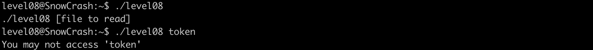

# Level08

## Exploration
In this level we find in `level08` directory :

- an excutable named `level08` owned buy flag08 and set-user-id and set-group-id bits set
- regular file with read and write permission only for the user `flag08`

the program accepts as an argument a file to read execpt that the file `token` cannot be read

let's understand why the program can't access the `token` file by tracing the library calls made by it using `ltrace`

looking through the output of `ltrace` the program calls the function `strstr()` which checks whether `haystack` contains the `needle` in our case its check whether the string `token` contains `token`

well maybe the programm doesn't a file that its name contains the word `token`

let's verify this assumption by creating a file named `file.txt`

good, its worked the program outputs the content of the file. hence we can't open any file with `token` work in its name

## experimentation
let's try to modify the name of the file

hmmm! we can't becuase we dont have write permissions

what if we try to create a soft link of `token` and change the name of the link

## exploitation

excellent the name of the link pointing to `token` got changed now let's try passing to the program

we got something let's trying switching to `level09`

error ! maybe that not the password, its the flag to access `flag09`, let's try switching to it 

we got in, we execute `getflag` and the password got  displayed : 25749xKZ8L7DkSCwJkT9dyv6f

<!-- 
the file is open in read mode `O_READ` so mode parameter is ignored and the value shown by ltrace is garbage data

If O_CREAT is used, a third argument specifying the file permissions (mode) for the newly created file is required. This is typically represented in octal (e.g., 0644). -->

## Read more

https://www.twingate.com/blog/glossary/symlink-attack