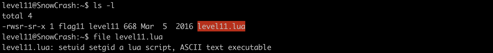
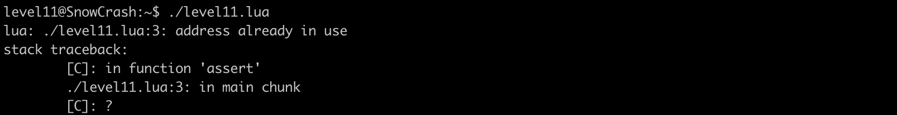
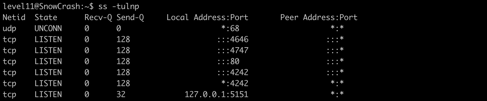
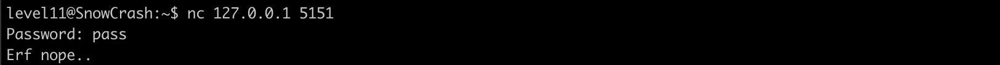
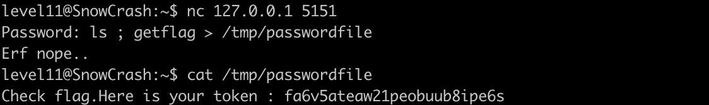

# Level 11

## Description


## Analysis

Entering this level we list files in the directory we found 2 files:
- lua script owned by `flag11` with SUID bit set




Executing the script results in an error `address already in use` in line 3 which tries to :
- create a socket 
- associate the socket with and IP address and a port



scanning for open ports in the machine affirms that `127.0.0.1:5151` is used
 


**127.0.0.1** means the socket is only listening on the loopback interface (localhost, not accessible from outside the machine).

**5151** is the port number where the service is listening.


The script is not meant to be executed, but its showing the programm listening on the loopback interface on port 5151 does

let's connect to it using **netcat**



the program prompt us to enter a password and printed `Erf nope..` . Probably the password is wrong


Let's go through the code to understand the script better

```lua

#!/usr/bin/env lua
local socket = require("socket") -- load the LuaSocket library, which provides networking capabilities
local server = assert(socket.bind("127.0.0.1", 5151)) -- create a socket and bind it with "loopback addrss" and the port 5151

function hash(pass)
  prog = io.popen("echo "..pass.." | sha1sum", "r")
  data = prog:read("*all")
  prog:close()

  data = string.sub(data, 1, 40) -- create a substring from data with len 40
  return data
end


while 1 do

  local client = server:accept() -- is a method of a server TCP object that waits for and accepts an incoming client connection.

  client:send("Password: ") -- is a method used to transmit data through a client socket object

  client:settimeout(60) -- is a command or method call used to configure a timeout setting for a client connection, where 60 typically represents 60 seconds. 

  --
  local l, err = client:receive()
  if not err then
      print("trying " .. l)
      local h = hash(l)

      if h ~= "f05d1d066fb246efe0c6f7d095f909a7a0cf34a0" then
          client:send("Erf nope..\n");
      else
          client:send("Gz you dumb*\n")
      end

  end

  client:close()
end
```

in line 5 we find a function **io.popen()** used to execute a shell command in a separate process in our case it executes echo with arguments passed to the function and the result of this execution gets redirected **sha1sum** which make a hash out of if .

## Cracking process


the vulnerability resides in **io.popen()** we will inject `getflag` in the arguements pass to echo `echo ls ; getflag > /tmp/password | sha1sum`




and we got the password for the next level : `fa6v5ateaw21peobuub8ipe6s`


