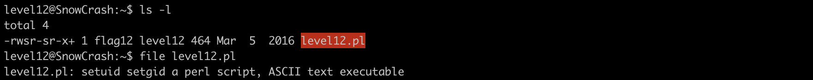
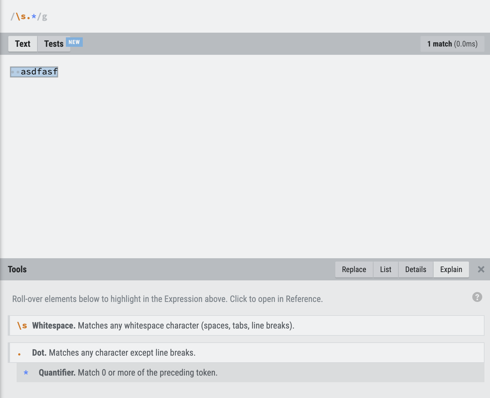
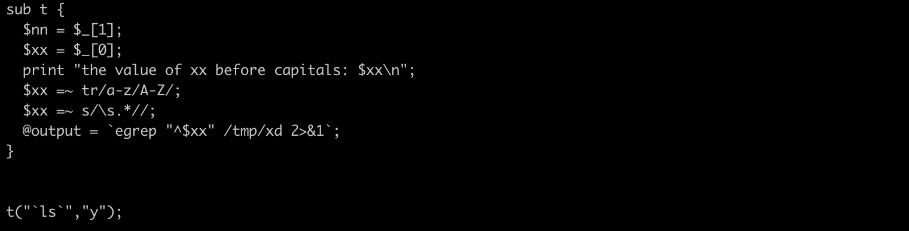
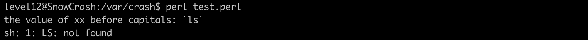
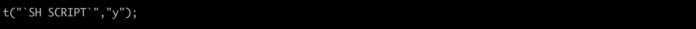

# Level 12

## Description 
## Analysis




```perl
#!/usr/bin/env perl
# localhost:4646
use CGI qw{param};
print "Content-type: text/html\n\n";

sub t {
  $nn = $_[1];
  $xx = $_[0];
  $xx =~ tr/a-z/A-Z/; # converts lowercase letters in the string $xx to uppercase
  $xx =~ s/\s.*//; # remove anything that start with whitespace
  @output = `egrep "^$xx" /tmp/xd 2>&1`;
  foreach $line (@output) {
      ($f, $s) = split(/:/, $line);
      if($s =~ $nn) {
          return 1;
      }
  }
  return 0;
}

sub n {
  if($_[0] == 1) {
      print("..");
  } else {
      print(".");
  }
}

n(t(param("x"), param("y")));
```








## Cracking process