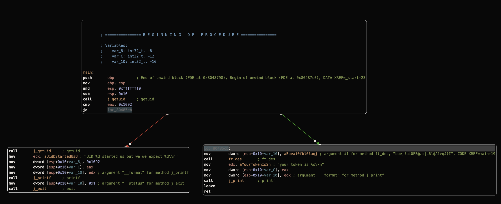

# Level 13

## Analysis

Entering this level we find a **32-bit executable with setuid and setgid bit set** owned by **flag13**


Executing the program result in a message `UID 2013 started us but we expect 4242`

which means the program has to be run by a user with **UID 4242**


when tracing the library calls by the program we found 2 functions calls :

- getuid() that gets the real UID of the calling process
- printf() which prints the message


The program checks our real UID and prints a message depending on it

Let's try to change our UID by creating a new user with UID 4242 using **useradd** command : 


As expected we can't create a new user because we don't have sudo privileges

we need to understand more about the what the program is doing **ltrace** and **strace** are not giving us much, so we are going to use **gdb  which is going to allow us to see what is going on ''inside'' the program while it executes**


We run **gdb ./level13** , set the disassembly flavor to intel for a more readable syntax and disassemble the main function to show all the assembler instructions from the main function. 

It looks complicated but we can ignore most of the instructions we will focus on the following instructions `call, cmp, je`


Here is a more simplified version of the assembler code 


Looking at the disassembly, the binary compares the result of getuid() (stored in eax) with 4242. This is the key check we need to bypass.

## Cracking process


Normally when we run a binary under gdb, the suid/sgid bits are ignored for security reasons - most systems disable suid/sgid execution when running under a debugger which means we can't **access files, make syscalls** but we can change registers value and see the effect while debugging.

Thus we will change the return value of `getuid()` stored in the **eax register** 

Since `cmp eax, 0x1092` checks if UID == 4242, forcing eax=4242 ensures the conditional jump goes to the success branch.


and we got the password for the next level `2A31L79asukciNyi8uppkEuSx`


<!--  -->


<!-- ```c
void main() {
    &saved_fp = &saved_fp & 0xfffffff0;
    if (getuid() != 0x1092) {
            printf("UID %d started us but we we expect %d\n", getuid(), 0x1092);
            exit(0x1);
    }
    printf("your token is %s\n", ft_des("boe]!ai0FB@.:|L6l@A?>qJ}I"));
    return;
}
``` -->

```c
int ft_des(int arg0) {
    var_C = strdup(arg_0);
    var_18 = 0x0;
    var_1C = 0x0;
    do {
            ecx = 0xffffffff;
            asm { repne scasb al, byte [edi] };
            if (!ecx - 0x1 <= var_1C) {
                break;
            }
            if (var_18 == 0x6) {
                    var_18 = 0x0;
            }
            if ((var_1C & 0x1) != 0x0) {
                    for (var_14 = 0x0; sign_extend_32(*(int8_t *)(var_18 + 0x80486c0) & 0xff) > var_14; var_14 = var_14 + 0x1) {
                            *(int8_t *)(var_1C + var_C) = (*(int8_t *)(var_1C + var_C) & 0xff) + 0x1;
                            if ((*(int8_t *)(var_1C + var_C) & 0xff) == 0x7f) {
                                    *(int8_t *)(var_1C + var_C) = 0x20;
                            }
                    }
            }
            else {
                    if ((var_1C & 0x1) == 0x0) {
                            for (var_10 = 0x0; sign_extend_32(*(int8_t *)(var_18 + 0x80486c0) & 0xff) > var_10; var_10 = var_10 + 0x1) {
                                    *(int8_t *)(var_1C + var_C) = (*(int8_t *)(var_1C + var_C) & 0xff) - 0x1;
                                    if ((*(int8_t *)(var_1C + var_C) & 0xff) == 0x1f) {
                                            *(int8_t *)(var_1C + var_C) = 0x7e;
                                    }
                            }
                    }
            }
            var_1C = var_1C + 0x1;
            var_18 = var_18 + 0x1;
    } while (true);
    eax = var_C;
    return eax;
}

```